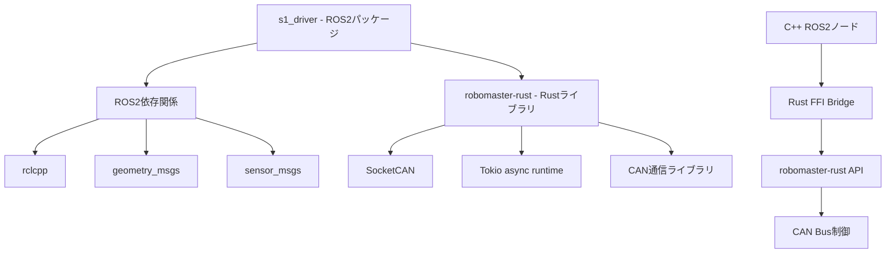

## `robomaster-rust` と `s1_driver` の依存関係とビルド方法

調査の結果、以下のような依存関係とビルド方法が明らかになりました。

### 依存関係の構造



### 依存関係の詳細

#### 1. **s1_driver → robomaster-rust**
- **依存タイプ**: Cargo.tomlでの相対パス依存
```toml
[dependencies]
robomaster-rust = { path = "../robomaster-rust" }
```

#### 2. **アーキテクチャ**
- **s1_driver**: RustとC++のハイブリッドパッケージ
- **robomaster-rust**: 純粋なRustライブラリ
- **統合方法**: FFI (Foreign Function Interface)ブリッジ

### ビルド方法

#### **前提条件の確認**
```bash
# CANインターフェースの設定（必要に応じて）
sudo ip link set can0 type can bitrate 1000000
sudo ip link set up can0

# ROS2環境の設定
source /opt/ros/humble/setup.bash
```

#### **1. 完全ビルド（推奨）**
```bash
cd /home/ikuo/s1_ws

# 全体ビルド（依存関係を自動解決）
colcon build --packages-select s1_driver

# 環境の設定
source install/setup.bash
```

#### **2. 段階的ビルド（開発時）**
```bash
# Step 1: robomaster-rustライブラリの確認
cd /home/ikuo/s1_ws/src/robomaster-rust
cargo check  # 依存関係チェック
cargo build  # ビルド（オプション）

# Step 2: s1_driverのRust部分の確認
cd /home/ikuo/s1_ws/src/s1_driver
cargo check  # FFI部分の確認

# Step 3: 完全ビルド
cd /home/ikuo/s1_ws
colcon build --packages-select s1_driver
```

#### **3. クリーンビルド**
```bash
cd /home/ikuo/s1_ws

# ビルドアーティファクトのクリーンアップ
rm -rf build/s1_driver install/s1_driver
cd src/s1_driver && cargo clean
cd ../robomaster-rust && cargo clean

# 再ビルド
cd /home/ikuo/s1_ws
colcon build --packages-select s1_driver
```

### ビルドプロセスの詳細

#### **CMakeによる自動Rustビルド**
`s1_driver/CMakeLists.txt`で以下が実行されます：

```cmake
# 1. Rustライブラリのビルド
add_custom_command(
    OUTPUT ${RUST_TARGET_DIR}/release/deps/lib${RUST_LIB_NAME}.a
    COMMAND cargo build --release --lib
    WORKING_DIRECTORY ${RUST_LIB_DIR}
)

# 2. C++実行ファイルとのリンク
target_link_libraries(s1_driver_node
  ${RUST_TARGET_DIR}/release/deps/lib${RUST_LIB_NAME}.a
  pthread dl m
)
```

### 生成されるアーティファクト

#### **Rustライブラリ**
- **静的ライブラリ**: `libs1_driver_rust.a` (約20MB)
- **動的ライブラリ**: `libs1_driver_rust.so` (約3.5MB)

#### **最終実行ファイル**
- **ROSノード**: `s1_driver_node` (ELF 64-bit executable)
- **インストール先**: `/home/ikuo/s1_ws/install/s1_driver/lib/s1_driver/`

### 実行方法

```bash
# ROS環境の設定
source /home/ikuo/s1_ws/install/setup.bash

# S1ドライバーノードの実行
ros2 run s1_driver s1_driver_node

# または、launchファイル経由で実行
ros2 launch s1_bringup s1_robot.launch.py
```

### トラブルシューティング

#### **よくある問題と解決法**

1. **CAN権限エラー**
```bash
sudo usermod -a -G dialout,can $USER
newgrp can
```

2. **Rustコンパイルエラー**
```bash
# Rustツールチェーンの更新
rustup update
```

3. **CMakeリンクエラー**
```bash
# Cargoキャッシュのクリア
cd src/s1_driver && cargo clean
cd ../robomaster-rust && cargo clean
```

### まとめ

- **s1_driver**は**robomaster-rust**に明確に依存している
- ビルド時には**robomaster-rust**が先にコンパイルされ、静的ライブラリとしてリンクされる
- CMakeが自動的にRustビルドプロセスを管理する
- FFIブリッジによりRustの高性能CAN制御機能をROS2から利用可能
- 単一の`colcon build`コマンドで依存関係を含めて完全ビルドが可能

この構成により、Rustの高性能な制御機能とROS2のロボット制御エコシステムが効果的に統合されています。